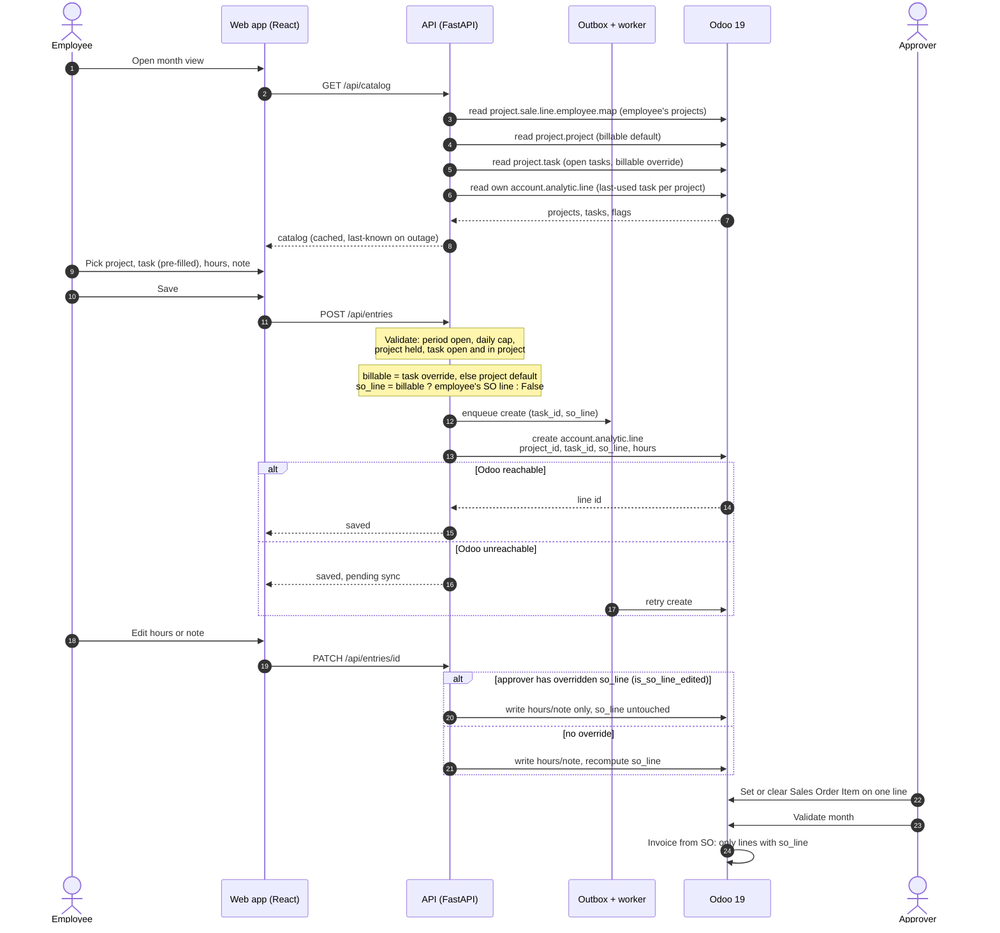
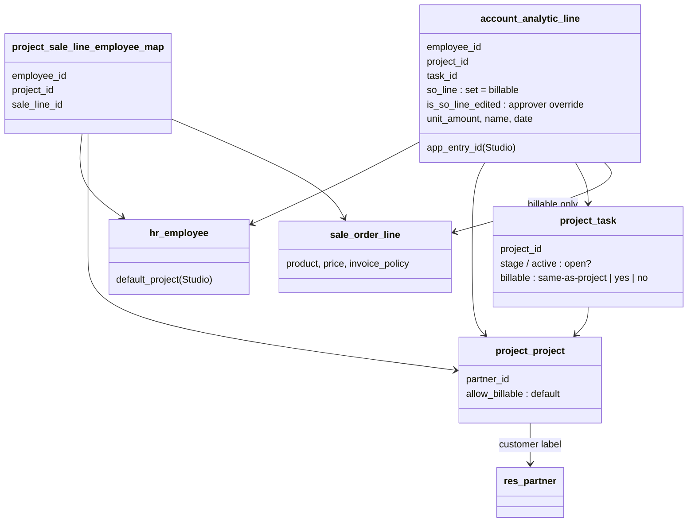

# Odoo Time Tracker — Implementation Plan

**Companion to `time-to-invoice-brief.md` (Draft v7). The brief decides *what*; this decides *how*, in the order it gets built.**

| | |
|---|---|
| **Stack** | Python 3.14 / FastAPI backend, React 19 + TypeScript (Vite 8) frontend |
| **Runtime** | Ubuntu 26.04 LTS VPS, Docker Compose, PostgreSQL 18, Caddy 2.11 |
| **Odoo** | Odoo 19 Enterprise (Odoo Online), live sandbox available now |
| **Versions** | Pinned and justified in Appendix E. Read it before writing a Dockerfile. |
| **Executed by** | Claude Sonnet, step by step, with a human at Phase 0 and at each phase gate |
| **Date** | 6 Sep 2026 — Phase 2b added 29 Sep 2026 (decision 0011) |

## How to use this plan

Every step has the same four parts:

- **Goal** — one sentence, what exists afterwards that did not before.
- **Do** — the implementation instructions.
- **Validate** — a command to run and the output that counts as success. Sonnet runs this itself and does not proceed until it passes.
- **Done when** — the objective condition. If it cannot be demonstrated, the step is not done, regardless of how much code was written.

Steps inside a phase are ordered by dependency. Phases have a **gate**: a human reviews before the next phase starts.

### Ground rules for the implementing model

These exist because the single largest source of failure in this project is confidently inventing Odoo behaviour that does not exist.

1. **Never assume an Odoo field name.** Every field this app reads or writes must first appear in the output of a probe script run against the live sandbox. Field names in this document marked *(verify)* are educated guesses from Community source and must be confirmed before code depends on them.
2. **Odoo capability facts live in `odoo_profile.json`**, generated by the probe scripts, committed to the repo, and loaded by the app at startup. Code refers to `profile.validation_field`, never to a hardcoded string. When Odoo changes, one file changes. The profile also records `odoo_version`, and the app compares it against the live instance at startup: **Odoo Online is the one component in this stack whose version we do not control** (see Appendix E), so a silent upgrade must produce a loud warning rather than a subtle bug.
3. **Never write to production Odoo.** Only the sandbox, only through the integration user, only inside the test project until Phase 3.
4. **A step is not done because the code looks right.** It is done when its validation command produces the stated output.
5. **When a probe contradicts this plan, the probe wins.** Stop, report the contradiction, and ask before working around it. Do not adapt silently.
6. **No secret ever enters the repo.** `.env` is gitignored, `.env.example` is committed with empty values.

## Architecture in one page

```
                        ┌──────────────┐
   employee browser ───▶│  React SPA   │
   (Google sign-in)     └──────┬───────┘
                               │ JSON over HTTPS, session cookie
                        ┌──────▼───────┐
                        │   FastAPI    │──── reads ───▶ Odoo 19 (assignments,
                        │     api      │                 entries, period state)
                        └──┬────────┬──┘
                enqueue    │        │ direct write attempt
                        ┌──▼────────▼──┐
                        │   Postgres   │   outbox + audit only.
                        │   (outbox)   │   No hours live here permanently.
                        └──────┬───────┘
                        ┌──────▼───────┐
                        │    worker    │──── retries ──▶ Odoo
                        └──────────────┘
```

**Odoo is the record.** Postgres holds three things and nothing else: the outbox of writes not yet confirmed in Odoo, an audit log of app-side actions, and short-lived caches with explicit TTLs. It never becomes a place hours are read from for reporting.

### The one honest exception to "nothing is read back from the queue"

The brief says the queue is never read from. Two operations must read it anyway, and pretending otherwise would produce a wrong app:

- **Rendering.** An entry saved while Odoo is unreachable has to appear in the employee's view, marked as not yet synced.
- **The daily cap.** If pending writes are excluded from the daily total, an employee can exceed the cap during an outage. The cap must count Odoo lines *plus* pending outbox rows.

The principle is preserved by making the overlay strictly temporary: outbox rows in synced state are pruned after 7 days, nothing outside the outbox module queries them, and no report, total, or export ever sources from Postgres. **Rule: if a number will be seen by anyone other than the employee who typed it, it comes from Odoo.**

### Repository layout

```
time-to-invoice/
├── docker-compose.yml
├── .env.example
├── Caddyfile
├── odoo_profile.json          # generated by probes, committed
├── docs/
│   ├── brief.md               # the v7 brief — the why. Snapshot, see below
│   ├── implementation-plan.md # this document — the how
│   ├── licensing-answer.md    # from step 0.10, when it arrives
│   ├── restore-drill.md       # the record from step 2.7
│   └── decisions/             # one short file per discovery that changed the plan
│       ├── 0001-app-entry-id-field.md
│       └── 0002-unpaid-recipe.md
├── tools/                     # probe + spike scripts, run by hand
│   ├── spike_odoo_timesheet_lock.py
│   ├── probe_assignments.py
│   ├── probe_unpaid_line.py
│   ├── probe_studio_fields.py
│   ├── probe_write_other_employee.py
│   └── build_profile.py       # runs all probes, writes odoo_profile.json
├── api/
│   ├── pyproject.toml
│   ├── src/tti/
│   │   ├── main.py
│   │   ├── config.py          # env + odoo_profile loading
│   │   ├── odoo/               # client, models, errors
│   │   ├── auth/                # google oidc, session, employee resolution
│   │   ├── domain/              # PURE rules: cap, increments, period, validity
│   │   ├── outbox/              # queue model, enqueue, worker, reconciler
│   │   ├── routes/
│   │   └── db/                  # sqlalchemy models, alembic
│   └── tests/
│       ├── unit/                # no network
│       └── odoo/                # marked, hits the live sandbox
└── web/
    ├── package.json
    └── src/
```

**On `docs/`.** Both the brief and this plan are committed. Sonnet works from the repo, and a repo that contains the *how* but not the *why* invites reasonable-looking decisions that quietly contradict a decision already made — the unpaid-assignment design, for instance, only makes sense if you have read why absorbed hours must stay on the client's project.

The brief is a snapshot, not the canonical copy. It lives with its owner and keeps moving; `docs/brief.md` carries its version and date at the top and gets refreshed when a new draft lands. Two copies drift, and the fix is to make the repo copy visibly a copy rather than to pretend it is the source.

`docs/decisions/` is where a probe result that contradicts this plan gets written down. Ground rule 5 says the probe wins and the contradiction is reported; this is where the report goes, in a few sentences — what was assumed, what the probe showed, what changed. It keeps the plan readable as intent while leaving a trail of where reality differed, which is exactly the question anyone will have in six months.

# Phase 0 — Odoo foundation

**Nothing in Phase 1 can be written honestly until this phase has produced `odoo_profile.json`.** Configuration here is done by a human in the Odoo UI; Sonnet writes and runs the scripts that prove the configuration is what the app needs.

Phase 0 is also where the brief's remaining unknowns get answered. Three of them are named in "Still open" and two more are surfaced below.

### 0.1 — Sandbox access and the integration user

**Goal.** An API key that authenticates and holds timesheet approver rights.

**Do.**

- Human: create user `integration@particles.global` in the sandbox as an **Internal User**, grant Timesheets → Administrator (the group behind `hr_timesheet.group_hr_timesheet_approver`), generate an API key under Preferences → Account Security.
- Human: create a second, ordinary employee user for comparison testing, with no timesheet rights beyond their own.
- Sonnet: create `.env` from `.env.example` with `ODOO_URL`, `ODOO_DB`, `ODOO_USER`, `ODOO_KEY`.

**Validate.**

```
python3 tools/spike_odoo_timesheet_lock.py | head -20
```

Expect `Connected to ... as uid=<n>` and `hr_timesheet.group_hr_timesheet_approver: True`.

**Done when** the integration user authenticates and reports `True` for the approver group.

### 0.2 — Run the locking spike and name the validation field

**Goal.** The exact field the app reads to decide whether a period is locked, confirmed on a real instance.

**Do.**

- Log a handful of timesheet lines in the sandbox across two months, then validate one month in the Timesheets grid.
- Run the spike **twice**: once with the integration user's credentials, once with the ordinary employee's.
- Record, in `odoo_profile.json`:
  - `validation_field` — the stored field on `account.analytic.line` that marks a validated line. *(verify — expected `validated`)*
  - `employee_validated_through` — the field on `hr.employee` holding the date through which that employee's timesheets are validated. *(verify — expected `last_validated_timesheet_date`)*
  - `company_validated_through` — the equivalent on `res.company`, used as fallback. *(verify)*
  - `readonly_is_user_relative` — true if `readonly_timesheet` differs between the two runs on the same line.
  - `odoo_version` — the full version string from `common.version()`, including the SaaS point release, not just "19.0".

**Do next, and this is the part that matters.** By hand, as the integration user, attempt write on a validated line's `unit_amount`, and attempt unlink on it. Record both outcomes in the profile as `validated_line_writable` and `validated_line_deletable`.

**Validate.**

```
python3 tools/build_profile.py && cat odoo_profile.json
```

Expect a JSON object with every key above populated, no null values, and `validation_field` naming a stored field.

**Done when** the profile names the validation field, and the write test result is recorded either way.

**If `validated_line_writable` is `true`** (the brief's expectation): the app is the only guard, exactly as designed. **If it is `false`**, Odoo refuses the write itself, and the app's lock becomes a second line of defence rather than the only one. Either way the app enforces it; the difference is how loudly a bug fails. Report which it is.

### 0.3 — Service products, in both invoicing modes

**Goal.** Role products that price themselves from a client pricelist, in both billing modes.

**Do.** Human, in Odoo:

- One service product per role sold (Senior Engineer, Engineer, QA, PM), Product Type = Service, **Invoicing Policy = Based on Timesheets**, **Create on Order = Project & Task**.
- A parallel set, or a variant, for flat-rate work: same roles, **Invoicing Policy = Prepaid/Fixed Price**. Name them so the difference is obvious on an order line.
- One pricelist per test client, setting the price of each role product for that client.

**Validate.** Sonnet reads back over the API:

```
python3 tools/probe_products.py
```

Expect each product printed with `service_policy` / `invoice_policy` and `service_tracking`, and a pricelist lookup returning the client-specific price for one role.

**Done when** the probe shows both policies present and the pricelist returns a different price for the same product under two different clients.

### 0.4 — A test engagement with per-employee order lines

**Goal.** The employee-to-order-line mapping the whole design rests on, proven for two employees on one project.

**Do.** Human:

- A customer, a project with **Billable** enabled, a sales order with one line per allocated person using that person's role product.
- On the project's Invoicing tab, map each employee to their own order line.
- Do this for two different employees on the same project, with different role products and therefore different rates.

**Validate.**

```
python3 tools/probe_assignments.py --employee <id>
```

The probe reads `project.sale.line.employee.map` *(verify — this is the Community `sale_timesheet` model that backs the Invoicing tab)* filtered by employee, and prints project, sale order line, and price. Expect exactly one row per employee, each pointing at a different order line.

The same probe also resolves **where assignment validity dates live**, since they come from the sales order rather than from a custom field. It runs `fields_get` on `sale.order.line` and `sale.order`, prints every date field on each, and writes the chosen pair into the profile as `assignment_start_source` and `assignment_end_source` — preferring line-level fields, because one line per allocated person means a line-level date is a per-person date. Set a start date on one test employee's line and confirm it reads back.

**Done when** the probe returns, for each of the two employees, a distinct order line on the same project, and the profile names the two date sources.

This is the step the brief calls "the first thing to prove in a sandbox". If `project.sale.line.employee.map` is not the model behind the Invoicing tab in Odoo 19, **stop and report** — the app's entire assignment-discovery mechanism depends on this model being readable and filterable by employee.

### 0.5 — The unpaid assignment, and Odoo's auto-fill

**Goal.** Certainty about how a non-billable line on a billable project is actually created.

**Why this is its own step.** The brief says an unpaid entry is "the same project, with the sales order line left empty". Odoo does not leave it empty on its own. When a timesheet line is created on a project where the employee has an order-line mapping, `so_line` is computed and filled automatically. Creating an unpaid line therefore means *creating and then explicitly clearing*, and the clearing must survive Odoo's recompute.

**Do.** Sonnet writes `tools/probe_unpaid_line.py`, which against the test project:

1. Creates a line with `so_line` unset. Reads it back. Records whether `so_line` was auto-filled.
2. Creates a line with `so_line: False` passed explicitly. Reads it back.
3. Takes an auto-filled line, writes `so_line: False`, reads it back, then writes an unrelated field (`name`) and reads `so_line` again to see whether the recompute refills it.
4. Checks for the presence of a flag that marks a manually-set order line *(verify — expected `is_so_line_edited`)*, and repeats step 3 with that flag set.
5. For each resulting line, reads `timesheet_invoice_type` and the order line's `qty_delivered` to confirm the unpaid line contributes nothing to what will be invoiced.

**Validate.**

```
python3 tools/probe_unpaid_line.py --cleanup
```

Expect a printed decision line: `UNPAID RECIPE: <the exact create/write sequence that produces a line with so_line empty that stays empty>`, and `qty_delivered unchanged: True`.

**Done when** the probe prints a recipe, that recipe is written into `odoo_profile.json` as `unpaid_recipe`, and re-running the probe reproduces it.

### 0.6 — The internal project

**Goal.** One catch-all project that cannot reach an invoice.

**Do.** Human: create the internal project with **Billable disabled** and no sales order. Sonnet: confirm no employee mapping exists on it and that a line created there has empty `so_line` and a non-billable `timesheet_invoice_type`.

**Validate.** `python3 tools/probe_internal_project.py` prints `so_line=False` and the non-billable invoice type for a freshly created line.

**Done when** a line on the internal project is provably unreachable by any sales order.

### 0.7 — Studio fields

**Goal.** The two custom fields the app needs, added in Studio and readable over the API.

**Do.** Human adds, and Sonnet records the generated technical names in the profile:

| Where | Purpose | Type | Profile key |
|---|---|---|---|
| `hr.employee` | Default assignment | Many2one → `project.project` | `default_project_field` |
| `account.analytic.line` | App entry id, for idempotent retries | Char, indexed | `app_entry_id_field` |

**On the assignment dates — decided: they come from the sales order, not from Studio.** An earlier draft proposed Studio date fields on the employee mapping; the owner's intent was the sales order, so that is what the app reads and there are no Studio date fields to add. This is the better answer anyway: dates on a commercial document are administered where the commercial terms already live, and there is one less custom field to maintain.

The design makes this work per person rather than per engagement, which is what the brief actually requires ("someone who joins a client mid-month can log from their assignment start date and not before"). Because each allocated person has **their own sales order line**, a date on the line is a date on that person's assignment. Order-level dates would only express the engagement's window, so line-level is preferred and order-level is the fallback.

**Which fields carry them is not yet known and must not be guessed.** Odoo's stock `sale.order.validity_date` is quotation expiry, not a delivery window, and line-level start/end dates appear on `sale.order.line` only with certain modules installed. Step 0.4's probe resolves this and records the answer in the profile as `assignment_start_source` and `assignment_end_source`, each a field path such as `sale.order.line.start_date` or `sale.order.date_order`. **If neither the line nor the order carries usable dates on this instance, stop and report** — the options are then a Studio date pair on the order line or dropping date enforcement, and that is the owner's call, not Sonnet's.

**On the app entry id.** This field does not appear in the brief and is the plan's one addition to the Odoo data model. It exists to solve a specific failure: a create request that times out after Odoo has already committed it. Without a durable app-side key on the record, a retry produces a duplicate timesheet line, and duplicates on an invoice are the exact failure this project exists to eliminate. With it, the retry first searches for the id and adopts the existing line. It is invisible to users and costs one indexed char column.

**Validate.**

```
python3 tools/probe_studio_fields.py
```

Expect both fields listed with their technical names, types, and `store=True`.

**Done when** both exist, and writing then reading back a value on each succeeds.

### 0.8 — Prove writes on behalf of another employee

**Goal.** Confirm the licensing-critical, design-critical assumption that one login can log time for everyone.

**Do.** As the integration user, create, update, and delete a timesheet line for each of the two test employees, neither of whom is the integration user.

**Validate.** `python3 tools/probe_write_other_employee.py` prints `create/update/delete OK` for both employee ids, with no `AccessError`.

**Done when** all six operations succeed.

### 0.9 — Flat-rate mode on the same project

**Goal.** Prove the two billing modes coexist, per the brief's first open item.

**Do.** On the test project, add a second sales order line using a fixed-price role product, mapped to a third employee. Log hours for that employee.

**Validate.** `python3 tools/probe_flat_rate.py` prints: the assignment probe returns this employee with their own order line; hours are recorded against it; the order line's invoiceable amount does not move with the hours.

**Done when** timesheet-invoiced and fixed-price lines both appear as ordinary assignments through the same code path.

### 0.10 — The licensing question (human, non-blocking)

Send the written question to the Odoo account manager. Record the answer in the repo as `docs/licensing-answer.md` when it arrives. This does not block any step; it changes the business case, not the build.

### 🚦 Phase 0 gate

- `odoo_profile.json` is complete, committed, and every value came from a probe
- The validation field is named, and the validated-line write test result is recorded
- The unpaid recipe is proven and reproducible
- The employee-to-order-line mapping returns distinct lines for two employees on one project
- Both billing modes work through the same assignment lookup
- Writes on behalf of other employees succeed
- Assignment validity dates resolved to real sales-order fields, named in the profile, and proven to read back
- Any probe that contradicted this plan has been reported and resolved

# Phase 1 — Walking skeleton

**One employee, one client, one entry, end to end. No polish, no second view, no queue.** The purpose is to prove the whole path exists before building anything on top of it.

### 1.1 — Scaffold and compose

**Goal.** `docker compose up` starts api, worker, web, db, and Caddy, and the app answers a health check.

**Do.**

- `api/`: FastAPI on Python 3.14, uv for dependency resolution and locking, structured JSON logging, `/healthz` returning `{"status":"ok","odoo":"<reachable|unreachable>","odoo_version":"...","version_matches_profile":true,"profile_loaded":true}`.
- `db/`: PostgreSQL 18, SQLAlchemy 2.0 with psycopg 3 (`postgresql+psycopg://`), Alembic initialised with an empty baseline migration.
- `web/`: Vite 8 + React 19 + TypeScript, built with Node 24 LTS, one page that fetches `/healthz`.
- `docker-compose.yml`: five services, healthchecks on api and db, `restart: unless-stopped`, named volume for Postgres data.
- Caddy terminating TLS, proxying `/api/*` to FastAPI and everything else to the built frontend.

**Validate.**

```
docker compose up -d && sleep 10 && curl -sf http://localhost/api/healthz | jq .
docker compose exec api python -c "import sys, psycopg, sqlalchemy, fastapi; print(sys.version, psycopg.__version__, sqlalchemy.__version__, fastapi.__version__)"
docker compose exec db psql -U tti -c "select version();"
docker compose build --no-cache api 2>&1 | grep -i "building wheel" || echo "no source builds"
```

Expect `status: ok`, `odoo: reachable`, `version_matches_profile: true`, `profile_loaded: true`; the interpreter and library versions matching Appendix E; PostgreSQL 18; and **no source wheel builds**, which would mean a dependency has no cp314 wheel and needs a version decision rather than a slow build.

**Done when** a cold `docker compose down -v && docker compose up -d` reaches a healthy state without manual intervention.

### 1.2 — The Odoo client

**Goal.** One typed, async, well-behaved way to talk to Odoo.

**Do.** `api/src/tti/odoo/client.py`:

- `httpx.AsyncClient` against `{ODOO_URL}/jsonrpc`, with a shared connection pool and a 15s timeout.
- `authenticate()` once at startup, uid cached, re-authenticated on session failure.
- `execute_kw(model, method, args, kwargs)` as the single primitive; everything else is built on it.
- **Error taxonomy**, because retry behaviour depends on it:
  - `OdooUnavailable` — connection error, timeout, 5xx. **Retryable.**
  - `OdooUncertain` — the request was sent but the outcome is unknown (timeout after send). **Retryable only via the reconcile path**, never by blind re-create.
  - `OdooRejected` — ValidationError, UserError, AccessError. **Not retryable.** Needs a human.
- Every call logged with model, method, duration, and outcome. Never log the API key.

**Validate.**

```
pytest api/tests/odoo/test_client.py -v
```

Tests: authenticate succeeds; a read on `res.users` returns the integration uid; a deliberately malformed call raises `OdooRejected` and not `OdooUnavailable`; a call to an unreachable host raises `OdooUnavailable` within the timeout.

**Done when** all four pass against the live sandbox.

### 1.3 — Google sign-in and employee resolution

**Goal.** A signed-in employee is an `hr.employee` id, or they are not signed in.

**Do.**

- Google OIDC authorization-code flow. Verify the ID token server-side with `google-auth`. **Reject any token whose `hd` claim is not the company domain**, and reject unverified emails.
- Resolve email → `hr.employee`: search `work_email = <email>` and `active = true`. Exactly one match is required. Zero matches and more than one match are both hard failures with distinct error messages, because they have different fixes.
- Issue a session JWT in an HttpOnly, Secure, SameSite=Lax cookie, 12-hour expiry, containing the employee id and the resolved timezone.
- Employee timezone comes from the Odoo employee/user record, cached for the session. It defines what "today" means.
- Cache the email→employee mapping for 15 minutes.

**Validate.**

```
pytest api/tests/unit/test_auth.py api/tests/odoo/test_employee_resolution.py -v
```

Tests: a token with a foreign `hd` is refused; an unknown email returns 403 with `employee_not_found`; a duplicated `work_email` in Odoo returns 403 with `employee_ambiguous`; a valid employee yields a session whose employee id matches Odoo.

Then by hand: sign in in the browser and confirm the session cookie is set and `GET /api/me` returns the right name and employee id.

**Done when** a real Google account signs in and resolves to the right employee, and a non-domain account cannot.

### 1.4 — Assignments, read live from Odoo

**Goal.** `GET /api/assignments` returns exactly what this employee may log against.

**Do.** Build the list from Odoo on every call (cached 60 seconds per employee):

1. Read `project.sale.line.employee.map` for this employee. Each row yields a **paid** assignment: project, sale order line.
2. Each paid assignment also yields an **unpaid** twin: same project, no order line.
3. Append the single **internal** assignment from config.
4. Label each with the project's customer name (`project.partner_id.display_name`). Where one customer has more than one project in the list, append the project name. Unpaid twins are labelled distinctly, in the UI's words, not Odoo's.
5. Attach validity dates, read from the sale order line or order per `assignment_start_source` and `assignment_end_source`. An assignment with no dates set is open-ended, not invalid.
6. Mark the employee's default, read from the Studio field on `hr.employee`. **If the default is not in the list, drop it and log a warning** rather than offering something they cannot use.

Assignment identity in the API is a stable string: `project:<id>:paid`, `project:<id>:unpaid`, `internal`.

**Validate.**

```
pytest api/tests/odoo/test_assignments.py -v
```

Tests: the mapped test employee gets exactly one paid, one unpaid, and the internal assignment; the flat-rate employee's assignment is indistinguishable in shape from the T&M one; a customer with two projects produces disambiguated labels; an employee with no mapping gets only the internal assignment; a default pointing at an unmapped project is dropped with a warning.

**Done when** adding a mapping in Odoo makes a new assignment appear on the next call, with no app change.

### 1.5 — One entry, written through

**Goal.** `POST /api/entries` creates an `account.analytic.line` in Odoo and returns it.

**Do.** No queue yet. Synchronous create, with:

- Server-side validation: the assignment is in *this employee's* list, hours are a positive multiple of 0.25, the date is within the assignment's validity dates.
- Field mapping: `date`, `employee_id`, `project_id`, `unit_amount`, `name` (the note, defaulting to a single space since Odoo dislikes empty descriptions — *verify*), `so_line` per the assignment kind and `unpaid_recipe`, and the app entry id in the Studio field.
- The response is built from a read-back of the created line, not from the request body. **The app never claims a write succeeded on the strength of its own optimism.**

**Validate.**

```
pytest api/tests/odoo/test_entry_create.py -v
```

Tests: a paid entry lands with the correct `so_line`; an unpaid entry lands with `so_line` empty *and stays empty after a subsequent unrelated write*; an internal entry lands on the internal project; an entry against an assignment the employee does not hold is refused with 403; 3.3 hours is refused, 3.25 accepted.

Then by hand: open Odoo, find the line, confirm date, employee, project, description, and order line.

**Done when** an entry created through the API is visible and correct in the Odoo UI.

### 1.6 — Minimal frontend

**Goal.** A signed-in employee can add an entry from a browser.

**Do.** One screen: sign-in, assignment dropdown, date, hours, note, save, and a list of today's entries. No styling beyond legible. Vite proxy in dev, built and served by Caddy in prod.

**Validate.** Manual, and recorded as a Playwright smoke test: sign in, add an entry, see it listed, confirm it in Odoo.

**Done when** the round trip works from a phone browser on the real domain.

### 🚦 Phase 1 gate

- One real employee signed in with Google and logged one real hour
- That hour is a correct timesheet line in Odoo
- Assignments come from Odoo configuration, with nothing hardcoded
- Unpaid entries stay unpaid after a subsequent write
- The Odoo error taxonomy distinguishes retryable from rejected

# Phase 2 — The product

Everything in Phase 2 is built on the skeleton without replacing it.

### 2.1 — Domain rules as pure functions

**Goal.** Every rule that can be wrong is testable without a network.

**Do.** `api/src/tti/domain/` holds pure functions with no I/O:

```python
def validate_increment(hours: Decimal) -> None
def validate_daily_cap(existing: Decimal, new: Decimal, cap: Decimal) -> None
def validate_within_assignment(date, start, end) -> None
def resolve_period_state(date, employee_validated_through, company_validated_through) -> PeriodState
def today_for(tz: str, now_utc: datetime) -> date
```

`PeriodState` is `OPEN` or `LOCKED`. **Locking is date-based, not line-based**: a date is locked if it falls on or before the employee's validated-through date, falling back to the company's. Reading a per-line flag would mean a round trip per line and would still be relative to the calling user, which the spike is expected to confirm.

The daily cap counts Odoo lines plus pending outbox rows for that employee and date.

**Validate.**

```
pytest api/tests/unit/ -v --cov=tti.domain --cov-fail-under=100
```

100% coverage of `domain/` is required, and is achievable precisely because these functions have no dependencies. Include boundary cases: exactly at the cap, one increment over, the validated-through date itself (locked), the day after (open), a date in a different year, midnight in the employee's timezone.

**Done when** the domain suite passes at 100% coverage and runs with the network disabled.

### 2.2 — Period state service

**Goal.** One place answers "may this employee edit this date?"

**Do.** Read the employee's validated-through date from Odoo (cached 5 minutes, invalidated on any 403 from a write). Expose `GET /api/periods` returning, for each of the last 12 months, its state. Every mutating endpoint calls the same guard.

**Validate.** `pytest api/tests/odoo/test_period_lock.py -v` — validate a month in the Odoo UI, then confirm: create in that month returns 409 `period_locked`; update of an existing line in it returns 409; delete returns 409; the following month still accepts all three.

**Done when** validating a month in Odoo makes the app refuse writes to it within the cache TTL, and the refusal is the app's own, independent of whether Odoo would have accepted the write.

### 2.3 — The outbox and worker

**Goal.** An employee's input is never lost to an Odoo outage.

**Do.** Table:

```sql
create table outbox (
  id            uuid primary key,
  employee_id   integer     not null,
  op            text        not null check (op in ('create','update','delete')),
  entry_date    date        not null,
  hours         numeric(5,2),
  assignment    text,
  project_id    integer,
  so_line_id    integer,
  note          text,
  odoo_line_id  integer,
  state         text        not null check (state in ('pending','synced','failed')),
  attempts      integer     not null default 0,
  next_attempt  timestamptz not null default now(),
  last_error    text,
  created_at    timestamptz not null default now(),
  updated_at    timestamptz not null default now()
);
create index on outbox (state, next_attempt);
create index on outbox (employee_id, entry_date) where state = 'pending';
```

Write path: enqueue as pending, then attempt the Odoo write inline. Success marks it synced and stores `odoo_line_id`. `OdooUnavailable` or `OdooUncertain` leaves it pending and returns 202 with the entry marked not-yet-synced. `OdooRejected` marks it failed and returns 4xx immediately, because retrying a rejected write only produces the same rejection.

Worker: polls every 10 seconds with `SELECT ... FOR UPDATE SKIP LOCKED`, exponential backoff (10s, 30s, 2m, 10m, 30m, capped at 1h), and **reconcile-before-create**: for a create with `attempts > 0`, first search `account.analytic.line` by the app entry id; if a line exists, adopt its id and mark synced instead of creating a second one.

Pruning: synced rows older than 7 days are deleted daily. `failed` rows are never auto-deleted.

**Validate.**

```
pytest api/tests/odoo/test_outbox.py -v
```

Tests, using a proxy that can be made to fail:

- Odoo unreachable at save → 202, row pending, nothing lost; Odoo returns → worker syncs within one backoff interval; **exactly one** line exists in Odoo.
- The uncertain case: kill the connection after the request is sent but before the response, then let the worker retry. Assert exactly one line in Odoo. **This is the test the whole idempotency design exists for.**
- A rejected write goes failed and is never retried.
- Two workers running concurrently do not double-process a row.

Then by hand: `docker compose stop` the network path to Odoo, save three entries, restart, watch the queue drain to empty.

**Done when** the uncertain-outcome test produces exactly one Odoo line across 20 consecutive runs.

### 2.4 — Full entry lifecycle

**Goal.** Create, edit, delete, all guarded, all through the outbox.

**Do.** `GET /api/entries?month=YYYY-MM`, `POST /api/entries`, `PATCH /api/entries/{id}`, `DELETE /api/entries/{id}`.

Reads: query Odoo for this employee's lines in the range, then overlay the outbox — pending creates appended, pending updates shown with their new values, pending deletes hidden. Each entry carries `sync_state`: `synced | pending | failed`.

Guards on every mutation, in this order: employee owns the line, period is open, assignment is held, date is within assignment validity, increment is valid, daily cap holds including pending rows.

Ownership is checked against Odoo's `employee_id` on the line, never against a client-supplied value.

**Validate.**

```
pytest api/tests/odoo/test_entry_lifecycle.py -v
```

Tests: edit changes the Odoo line rather than creating a new one; delete removes it; editing another employee's line returns 403 even though the integration user has the rights to do it; the cap counts pending rows; a locked period refuses all three operations; the month view matches Odoo exactly once the queue is empty.

**Done when** the reconciliation assertion holds: for a given employee and month with an empty queue, the app's view and Odoo's line list are identical, item for item.

### 2.5 — Current period view

**Goal.** Under a minute to log a normal day.

**Do.**

- The open month, day by day, newest first, with a quick-add form pre-filled with today's date and the employee's default assignment.
- Running totals: month to date, and per assignment.
- Days with no entry made visibly empty, so gaps are noticed during the month.
- Period status shown plainly: open, or approved and locked.
- Pending entries visibly marked, with a plain explanation rather than an error.
- Hours entered as a number or as quarter-step controls; the client mirrors the server's rules but the server is the authority.
- Responsive, usable one-handed on a phone. No money anywhere in the UI, and no field in any API response that carries a rate or amount.
- Built to the design language in **Appendix F**: brand tokens, the month-as-object layout, and the copy rules for empty, locked, and failed states.

**Validate.** Playwright: log an entry in under 60 seconds from a cold load; the cap is refused with a clear message; a locked month renders read-only with no editable control; the pending state renders during a simulated outage. Plus a test asserting **no API response body contains `price`, `amount`, `rate`, or a currency field**.

**Done when** a person who has not seen the app logs a day without being told how.

### 2.6 — Time tracking listing

**Goal.** "What did I do in June" is answerable without asking anyone.

**Do.** All entries across periods, filter by month and assignment, free-text search on notes, closed periods read-only and visibly so. Server-side filtering, paginated.

**Validate.** Playwright over an employee with entries in three months, one of them locked: filters return the right sets, search matches note text, the locked month exposes no edit affordance and its API mutations return 409.

**Done when** filtering and search work over a full year of seeded data without a perceptible wait.

### 2.7 — Operations

**Goal.** The people running this find out about problems before employees do.

**Do.**

- `/healthz` (liveness) and `/readyz` (Odoo reachable, profile loaded, DB reachable, oldest pending row younger than 15 minutes).
- Daily digest email to ops: pending rows older than 15 minutes, all failed rows, employees with no assignment, employees with no entry in the last 5 working days.
- Structured logs to file, rotated; a `docker compose logs` recipe in the README.
- `pg_dump` nightly to a separate volume, retained 14 days. The outbox is small but a lost queue is lost employee input.
- A documented restore drill, run once during Phase 2 and recorded.
- `.env` permissions locked down, key rotation procedure written and **rehearsed once** with the sandbox key.

**Validate.** Force a failure of each kind, confirm it appears in the digest within a day. Restore last night's dump into a scratch database and confirm the queue is intact.

**Done when** the restore drill has been performed and written down.

### 2.8 — Hardening

**Do.** Rate limit per session; strict CORS; security headers via Caddy; request size limits; an `audit_log` table recording every mutation with employee, action, target, timestamp, and outcome; dependency audit (pip-audit, npm audit) clean of high severities; no secret in logs or error responses.

**Validate.** `pytest api/tests/security/ -v` plus a manual pass: session cookie flags correct, an expired session is refused, a mutation with another employee's id is refused, error responses carry no stack trace.

### 🚦 Phase 2 gate

- Domain rules at 100% unit coverage, network disabled
- App-enforced period locking demonstrated independently of Odoo's behaviour
- Outage test: input survives, queue drains, exactly one line per entry
- Uncertain-outcome test passes 20 consecutive runs
- App view and Odoo line list reconcile exactly for a full month
- No rate or amount in any response body
- Backup restored successfully in a drill
- Key rotation rehearsed

# Phase 2b — Tasks and billability

**Time is logged against a project and a task, and billability is decided at three levels: project, task, and time record.** Added after the Phase 2 gate, before the pilot, so the pilot runs the model that goes live. The decisions and the brief decisions this changes are in `docs/decisions/0011-tasks-and-three-level-billability.md`; read it first.

**The rule.** Ops sets a billable default on the project and can override it per task (*Same as project* / *Billable* / *Not billable*). The app derives each line's billability from those two when it writes the line. The approver can override any single line afterwards, in Odoo, by setting or clearing its Sales Order Item. **The employee is never asked and never shown.** In Odoo, billable still means exactly one thing: `so_line` is set.

**Everything below runs against `particlesg.odoo.com`, not the trial.** Step 2b.2 is the "re-run the probe suite against the real sandbox" task that previously opened Phase 3.

### The flow



### The entities



Every field named in the diagrams except those already in `odoo_profile.json` is *(verify)*: `allow_billable`, the task's open/closed signal, the task billable field, `task_id` on the line, and `is_so_line_edited`.

### 2b.1 — Decision record and brief

**Goal.** The change is written down before any code depends on it.

**Do.** `docs/decisions/0011-tasks-and-three-level-billability.md` records the ten owner decisions, the two assumptions, and the brief decisions reversed. The brief is amended to v8 in place: the core-idea table, the unpaid section, the entry fields, the "what lands in Odoo" table, the decisions list and the phases table.

**Validate.** Owner reads both documents and confirms.

**Done when** the owner has confirmed, and no statement in the brief contradicts 0011.

### 2b.2 — Existing probe suite against the real sandbox

**Goal.** `odoo_profile.json` describes `particlesg.odoo.com`, not the trial.

**Do.** Provision the integration user on particlesg with Timesheets approver, Project and Sales access from the start, plus the `mail.mail` read/create grant (0009) — see the environment quirks in `CLAUDE.md`. Re-create the test project, test employees, mappings, the Studio fields from 0.7 and the internal project. Then re-run every probe from Phase 0 without modification, and `build_profile.py`. Re-check each trial quirk in `CLAUDE.md` (`has_group()` faulting, `create()` returning a list over XML-RPC, the `partner_id` reset, `readonly_timesheet`) and record which ones still hold.

**Validate.**

```
python3 tools/build_profile.py && git diff odoo_profile.json
```

Every key present; every difference from the trial profile explained in a decision record or confirmed as expected. Then `pytest api/tests/odoo/ -v` passes against the sandbox, unchanged.

**Done when** the existing app runs green against particlesg with the regenerated profile, before any Phase 2b code exists. A failure here is a sandbox difference, not a Phase 2b bug, and must be understood first.

### 2b.3 — Probe tasks and billability

**Goal.** Every Odoo fact the new model needs is confirmed on the sandbox and written into the profile.

**Do.** `tools/probe_tasks.py`, against the test project, with `--cleanup`:

1. **Project flag.** Read `project.project` fields; confirm the billable toggle *(verify: `allow_billable`)* and what it reads as on the test project and the internal project.
2. **Task fields.** List `project.task` fields. Name the open/closed signal *(verify: `state` with closed values such as `1_done`/`1_canceled`, or `stage_id.fold`, or `is_closed`)*, `active`, and `sale_line_id`. Report whether anything native could serve as a three-valued billable override. If nothing does, **stop and ask** before adding the Studio selection field in 2b.4.
3. **Line field.** Confirm `task_id` on `account.analytic.line`, and that a task from another project is refused (or not) by Odoo itself.
4. **Recompute with a task.** On a project where the test employee has a mapping, and on a task whose `sale_line_id` differs from the employee's mapped line:
   - create a line with `task_id` set and `so_line` unset; record which order line Odoo fills in (task's or employee's);
   - create with `task_id` set and `so_line: False` explicitly — the current `unpaid_recipe` — then write `name`, then write `unit_amount`, and read `so_line` after each. **The recipe must hold with a task set**, or the plan changes here;
   - create billable with `so_line` = employee's mapped line explicitly; confirm it sticks.
5. **Approver override marker.** Set `so_line` on an unbillable line by a separate write, as the approver would in the UI. Read the manual-edit marker *(verify: `is_so_line_edited`)*. Then write `unit_amount` and `name` as the app would; confirm `so_line` and the marker both survive. Repeat with an override that clears `so_line`. **If the marker is not reliably set by a UI-style edit, stop** — the app cannot protect overrides and needs another signal (e.g. a Studio flag the approver ticks), which is an owner decision.
6. **Billable task on an unbillable project.** With no employee mapping, create a line on a *Billable* task on the internal project; confirm `so_line` stays empty and `timesheet_invoice_type` is non-billable.
7. For each line, read `timesheet_invoice_type` and the order line's `qty_delivered` before and after, as in 0.5.

Write the results into the profile: `project_billable_field`, `task_open_domain`, `task_billable_field` and its three value names, `line_task_field`, `so_line_manual_marker_field`, and an updated `unpaid_recipe` if it changed.

**Validate.**

```
python3 tools/probe_tasks.py --cleanup
```

Expect printed decision lines: `UNPAID RECIPE WITH TASK: <recipe>`, `OVERRIDE MARKER: <field> survives app write: True`, `BILLABLE TASK, NO MAPPING: so_line=False`, and `qty_delivered unchanged: True` for every unbillable line.

**Done when** the profile holds every new key and re-running the probe reproduces them. Any contradiction with 0011 goes into a new decision record before 2b.4 starts.

### 2b.4 — Odoo configuration

**Goal.** The sandbox has tasks that exercise every billability case.

**Do.** Human, in Odoo:

- The task billable field on `project.task`, per 2b.3 (Studio selection, default *Same as project*, if nothing native).
- On the T&M test project: a *Same as project* task, a *Not billable* "Rework" task, and one task left in a closed stage.
- On the flat-rate test project: a *Same as project* task and a *Not billable* task.
- On an unbillable test project with the employee mapped: a *Billable* task (task overrides project).
- On the internal project: PTO, Bench, Training, Internal work — all *Not billable* — plus one *Billable* task to exercise the no-mapping case.

Sonnet: `tools/p2bs04-check_task_setup.py` lists every task on those projects with its resolved billability per the rule, for a human to eyeball against the list above.

**Validate.** The script's output matches the list above exactly.

**Done when** every row of the 2b.5 truth table has a real task in the sandbox that produces it.

### 2b.5 — Billability as a pure function

**Goal.** The rule is one function with no I/O, fully tested.

**Do.** In `domain/`: `resolve_billing(project_billable, task_override, mapped_so_line_id) -> (so_line_id | None, warning | None)`. `task_override` is one of *same-as-project* / *billable* / *not-billable*, mapped from the profile's value names at the Odoo boundary, never compared as raw strings in the domain. Billable with no mapped line returns `None` and the warning `billable_without_order_line`.

**Validate.**

```
pytest api/tests/unit/test_billing_rule.py -v
```

Tests: the full truth table (2 project values × 3 task values × mapped/unmapped = 12 cases), each asserted explicitly, not generated from the rule under test.

**Done when** 100% coverage of the function, network disabled, as for the rest of `domain/`.

### 2b.6 — The catalog, read live from Odoo

**Goal.** `GET /api/catalog` returns exactly the projects and tasks this employee may log against.

**Do.** Replaces `AssignmentService` and `GET /api/assignments`. Same caching (60 s per employee) and the same last-known fallback on outage (0010).

1. Projects: every project in `project.sale.line.employee.map` for this employee, **plus every active unbillable project that allows timesheets (decision 0014 — there is no longer an "internal project" in config)**. One entry per project — **no paid/unpaid twins.**
2. Labels: customer name, with the project name appended where one customer has two projects in this employee's list; an unbillable project is named by its own project name (0014).
3. Tasks: per project, the open tasks per `task_open_domain`, id and name only. **No billability in the response** — the employee is never shown it; the server resolves it at write time.
4. Default project: the Studio field on `hr.employee`, dropped with a warning if not in the list (unchanged behaviour).
5. Last-used task per project: the `task_id` of the employee's most recent line on that project, if that task is still open. Otherwise none, and the UI asks.

A project with no open tasks is listed with an empty task list and cannot be logged against. The digest reports it for ops.

**Validate.**

```
pytest api/tests/odoo/test_catalog.py -v
```

Tests: the mapped employee sees each test project once and the internal project; the closed task is absent; a task from another project never appears under this one; last-used task follows the most recent line; a closed last-used task is not offered; the response contains no billing field of any kind; the outage fallback serves last-known.

**Done when** ops adding a task in Odoo makes it appear on the next uncached call, with no app change.

### 2b.7 — Entries carry a task

**Goal.** Create, update and delete write project, task and a derived `so_line`, and never undo an approver override.

**Do.**

- **Request shape.** Entries take `project_id` and `task_id` instead of `assignment_id`. Responses carry `project_id`, `task_id` (nullable for legacy lines) and labels. No billability field.
- **Create.** Validate: task is required (`task_required`), belongs to the project (`task_not_in_project`), is open (`task_not_open`), project is held (`project_not_held`, replacing `assignment_not_held`). Resolve `so_line` with 2b.5's rule and write it by the recipe from 2b.3. A `billable_without_order_line` warning is written to the audit log and picked up by the daily digest; the employee sees a normal save.
- **Update.** Read the line's override marker first. If set: hours, date and note may change and `so_line` is not written; a change of project or task is refused with `billing_set_by_approver` (0011). If not set: re-resolve `so_line` whenever project or task changes. A legacy line with no task must be given one on edit (`task_required`).
- **Delete.** Unchanged, including for lines with an override.
- **Outbox.** Payloads gain `task_id`. The Alembic migration converts queued rows from the old shape: `assignment_id` becomes `project_id` with `task_id` null, and the `so_line` the old kind implied is recorded explicitly, so a legacy create still lands exactly as it would have. Drain-time guards (0010) unchanged.
- **Read-back.** Lines map to project, task (or "No task"), and entry identity as before; `_to_entry` no longer infers an assignment kind from `so_line`.
- **Search.** `/api/entries/search` filters by `project_id` and `task_id` instead of `assignment_id`.

**Validate.**

```
pytest api/tests/odoo/test_entry_tasks.py api/tests/odoo/test_entry_create.py -v
```

Tests: one create per 2b.5 truth-table row, asserting `so_line` on the Odoo line; an unbillable line with a task stays unbillable after hours and note edits; an approver-set override survives an employee edit of hours and note, in both directions (set and cleared); changing the task of an overridden line is refused; a legacy task-less line cannot be edited without a task but can be deleted; a closed task is refused; a task from another project is refused; the old-shape outbox row migrates and drains to the right line.

**Done when** the Phase 2 gate's reconciliation test passes again with tasks, now also comparing `task_id` per line.

### 2b.8 — UI

**Goal.** Logging a day takes the same number of taps as before for the usual case.

**Do.**

- Quick add: project picker, pre-filled with the default; task picker, pre-filled with the last-used task on that project. Changing the project re-fills the task. Unpaid twins gone from the picker.
- Month view: totals per project only, as today, with no per-task breakdown (decision 0012). Where individual lines are listed, each names its task; legacy lines show "No task".
- Editing a legacy line opens with the task picker empty and required.
- `billing_set_by_approver` shows a plain sentence: the approver has set how this line is billed; ask them to move it.
- History: filter by project and task.
- No billability, anywhere.

**Validate.** `npm run e2e` with new specs: log against a pre-filled task; change project and see the task re-fill; edit a legacy line and be forced to pick a task; a closed task is not offered. All e2e rules from `CLAUDE.md` apply (fixtures, `e2e-suite` prefix).

**Done when** a normal day is logged in under a minute from opening the app, timed by hand.

### 🚦 Phase 2b gate

- Existing test suite passes against particlesg with the regenerated profile (2b.2)
- `probe_tasks.py` reproduces every decision line; the unpaid recipe holds with a task set
- Billing rule at 100% unit coverage; every truth-table row demonstrated on a real Odoo line
- An approver override survives an employee edit, in both directions
- Zero unbillable lines contribute to `qty_delivered` on any order line
- App view and Odoo line list reconcile for a full month, including `task_id`
- No billability, rate or amount in any response body

# Phase 3 — Pilot

**A handful of employees run one full month in the app while their spreadsheets continue in parallel.** Invoices are still produced the old way. The month's purpose is to find the gap between the plan and the work.

**Do.**

- Point the app at production Odoo with production configuration mirroring the sandbox. Re-run the full probe suite against production and regenerate `odoo_profile.json`. **Sandbox and production can differ; assume they do until proven otherwise.**
- Pick 3–5 people covering: T&M, flat rate, someone with two clients, someone who takes PTO in the month, and someone who logs on an unbillable task on a client project (Phase 2b).
- The approver makes at least one time-record billability override in Odoo during the month, and the employee edits that line afterwards.
- A written comparison at close: for each pilot employee, spreadsheet total vs Odoo total, per day and per assignment. **Any discrepancy is investigated to root cause before Phase 4**, not averaged away.
- Run one full approval and lock cycle in Odoo with the approver, and one deliberate after-the-fact correction, to walk the correction path before it matters.
- Collect the things nobody predicted. The brief's "Later" list is decided here, not now.

**Validate.** A comparison document showing per-employee totals from both systems, with every difference explained. Zero unexplained differences is the bar.

**Done when** one month reconciles fully and the approver has completed a real validate-and-lock pass.

### 🚦 Phase 3 gate

- Pilot month reconciles, spreadsheet against Odoo, with no unexplained difference
- The approver has validated a month and confirmed the app locked it
- A correction after validation has been made and the trail is visible in Odoo
- The queue never held a row longer than 15 minutes
- Owner has decided the credit-note vs next-invoice-adjustment question

# Phase 4 — Rollout and cutover

**Do.**

- Configure every remaining employee: role product, pricelist entry, order line, employee mapping, default assignment. This is the bulk of the work and it is Odoo configuration, not code. Script the mapping creation and **verify with the assignment probe per employee** rather than trusting the script.
- Announce the cutover date, one month boundary, no dual running beyond it.
- Offboarding agreement with IT in writing before the first leaver: the Google account stays active until the final month is validated.
- Retire spreadsheets. Archive as-is, per the brief. No migration.
- First live invoicing run from Odoo, with the old method computed alongside once as a check, then dropped.

**Validate.** Every employee has at least one assignment and a valid default; a full month closes and invoices are produced from the sales orders in under 30 minutes of human time; zero non-billable hours appear on any client invoice.

**Done when** the "what done looks like" list in the brief is true, measured.

## Appendix A — Environment

```
# Odoo
ODOO_URL=https://particlesg.odoo.com
ODOO_DB=particlesg
ODOO_USER=integration@particles.global
ODOO_KEY=

# Google
GOOGLE_CLIENT_ID=
GOOGLE_CLIENT_SECRET=
GOOGLE_HOSTED_DOMAIN=particlesglobal.com

# App
SESSION_SECRET=
DAILY_HOUR_CAP=10
INTERNAL_PROJECT_ID=
PUBLIC_BASE_URL=https://time.particles.global

# Postgres
POSTGRES_PASSWORD=
DATABASE_URL=postgresql+psycopg://tti:${POSTGRES_PASSWORD}@db:5432/tti
```

`DAILY_HOUR_CAP` is an environment variable because the brief makes raising it an ops action. Changing it is a deploy, which is the right amount of friction.

`GOOGLE_HOSTED_DOMAIN` above was corrected during step 1.3 — see `docs/decisions/0007-google-hosted-domain.md`. The original guess, `particles.global`, disagreed with every real `hr.employee.work_email` in the live trial.

## Appendix B — API surface

| Method | Path | Notes |
|---|---|---|
| GET | `/api/me` | Employee identity, timezone, default assignment |
| GET | `/api/catalog` | Phase 2b, replaces `/api/assignments`: projects and their open tasks, last-used task per project. Live from Odoo, this employee only, no billability |
| GET | `/api/periods` | Last 12 months, open or locked |
| GET | `/api/entries?month=` | Odoo lines overlaid with pending outbox |
| GET | `/api/entries/search?month=&project_id=&task_id=&q=&limit=&offset=` | Step 2.6: across periods, filtered, paginated (`{items, total}`). Synced Odoo lines only — no pending overlay, see `EntryService.search`'s own note |
| POST | `/api/entries` | 201 synced, 202 pending, 4xx rejected |
| PATCH | `/api/entries/{id}` | Same guards as create |
| DELETE | `/api/entries/{id}` | Same guards as create |
| GET | `/healthz` `/readyz` | Liveness, readiness |

Errors return `{"error": "<stable_code>", "message": "<human sentence>"}`. Stable codes: `employee_not_found`, `employee_ambiguous`, `period_locked`, `assignment_not_held`, `assignment_not_valid_on_date`, `daily_cap_exceeded`, `invalid_increment`, `odoo_unavailable`.

Phase 2b: entries take `project_id` + `task_id` instead of `assignment_id` (the 2.6 search's `assignment_id` filter becomes `project_id`/`task_id` too). `assignment_not_held` becomes `project_not_held`, and four codes are added: `task_required`, `task_not_in_project`, `task_not_open`, `billing_set_by_approver`.

## Appendix C — Test strategy

| Layer | Runs where | Gate |
|---|---|---|
| `tests/unit/` | No network, every commit | 100% coverage of `domain/` |
| `tests/odoo/` | Live sandbox, before each phase gate | All pass, test data cleaned up |
| `tests/security/` | No network | All pass |
| Playwright | Against a running compose stack | Smoke paths pass |
| Probes | By hand, at Phase 0 and again in Phase 3 | Regenerate `odoo_profile.json` |

Odoo tests use a dedicated test employee and test project, tagged so they can be found and cleaned, and are never pointed at production.

## Appendix D — Risks and open questions

| # | Item | Impact if wrong | Resolved at |
|---|---|---|---|
| 1 | `project.sale.line.employee.map` is not the assignment source in Odoo 19 | Assignment discovery has no mechanism; design change | Step 0.4 |
| 2 | Unpaid lines cannot be kept unpaid through recomputes | Absorbed work reaches invoices; the failure this project exists to prevent | Step 0.5 |
| 3 | Validated lines are writable over the API | None if expected; app is the guard either way | Step 0.2 |
| 4 | Neither the sales order nor its lines carry usable start/end dates on this instance | Validity cannot be enforced as the brief promises; needs a Studio pair on the order line or dropping the rule | Step 0.4 probe, escalate to owner |
| 5 | Licensing answer is unfavourable | Business case changes; build still worth it | Step 0.10, owner |
| 6 | A leaver's Google account is disabled on their last day | Their final month must be entered by the approver | Phase 4, needs IT agreement |
| 7 | A flat rate is agreed for a whole team, not per person | Different configuration; one line, and a rule for whose hours attach | Escalate if it occurs |
| 8 | Sandbox and production Odoo differ | Phase 3 surprises | Step 3, re-run probes |
| 9 | Two people in one role on one client at different rates | Needs a person-specific product or a manual price | Visible exception, not routine |
| 10 | Odoo Online upgrades the instance under us (SaaS point releases; Odoo 20 expected around Oct 2026) | Field names or behaviour shift mid-build with no deploy on our side | Startup version check + scheduled probe re-run, Appendix E |
| 11 | Aeonik's web licence does not cover a second host | The app cannot ship with the brand face until an extension is bought | Before Phase 2 UI work, Appendix F |
| 12 | Setting `task_id` makes Odoo recompute and refill `so_line` on an unbillable line | Absorbed work reaches invoices again, through tasks | Step 2b.3 |
| 13 | Odoo does not reliably mark an approver's manual Sales Order Item change | The app cannot tell an override from its own write, and an employee edit could undo it; needs an owner decision on another signal | Step 2b.3, escalate to owner |
| 14 | No native three-valued task billability | A Studio selection field on `project.task`; one more field to configure per task | Step 2b.3 |
| 15 | A task resolves billable but the employee has no order line on that project | Line saved unbillable; hours go unbilled until the approver sets its Sales Order Item in Odoo (decision 0012) | Daily digest, 2b.7; how the approver is told is open (0012) |

## Appendix E — Versions and version policy

Checked against upstream release and support schedules on 6 Sep 2026. The selection rule is **the newest version whose support window is already open and long**, which is not always the newest version that exists.

### Platform

| Component | Version | Supported until | Why this one |
|---|---|---|---|
| Ubuntu Server | **26.04 LTS** (Resolute Raccoon) | Apr 2031, ESM to 2036 | Released 23 Apr 2026; the 26.04.1 point release landed 6 Aug 2026, which is when the upgrade path opens and the early bugs are shaken out. Five years of standard support. Note it removes cgroup v1, which is fine on Docker 29 but breaks older tooling. |
| Docker Engine | **29.x** (29.7.2 at time of writing) | Rolling | Docker has no LTS. A year-month branch is patched for about one month past the next GA, so the only sane policy is to track current stable with unattended security upgrades. |
| Docker Compose | **v2 plugin** (`docker compose`) | Rolling | v1 is long dead. |
| PostgreSQL | **18** | **14 Nov 2030** | Released 25 Sep 2025, so a year of production mileage and four more years of support. **Not 16**, which was in my first draft and ends Nov 2028. **Not 19**, which is due in the next few weeks on Postgres's annual late-September cadence — the outbox is small and boring, and there is nothing in it worth being three days ahead for. |
| Caddy | **2.11.x** | Rolling | Latest 2.x line. Note CVE-2026-27590 affected the fastcgi module, which we do not use. |

### Backend

| Component | Version | Notes |
|---|---|---|
| Python | **3.14** | Released 7 Oct 2025. Full bugfix support to ~Oct 2027, security to **Oct 2030**. 3.15 ships 1 Oct 2026, three weeks out, and buys nothing. Consequence worth knowing: the Pydantic team dropped v1 support on 3.14 entirely, including the `pydantic.v1` shim, so v2 is not optional. |
| FastAPI | **0.139.x**, pinned exactly | Still pre-1.0, and minor bumps have carried real changes (0.126.0 dropped Pydantic v1 outright). Pin the exact version and upgrade on purpose, never with a caret range. |
| Pydantic | **2.13.x** | v2 only, per the Python 3.14 note above. |
| SQLAlchemy | **2.0.5x** | 2.0 API only, no legacy Query. |
| Alembic | **1.17+** | |
| psycopg | **3.x** (`psycopg[binary,pool]`) | Chosen over asyncpg for two reasons: one driver serves both the async app and sync Alembic, and its wheel coverage for new CPython releases has been the more reliable of the two. If a cp314 wheel is missing for anything, the build compiles from source silently and slowly, which the validation step below catches. |
| httpx | **0.28.x** | The Odoo JSON-RPC client. |
| uvicorn | **0.38+** | |

### Frontend

| Component | Version | Notes |
|---|---|---|
| Node.js | **24 LTS**, build-time only | Active LTS, EOL 30 Apr 2028; enters maintenance 20 Oct 2026. Node 26 is promoted to LTS in Oct 2026, and from 26 onward Node moves to one release a year with every release becoming LTS. Move to 26 after it is promoted — a one-line Dockerfile change, low risk because Node never runs in production here: Caddy serves a static build. |
| Vite | **8.x** | 8.0 shipped Mar 2026 with Rolldown replacing esbuild and Rollup. Requires Node 20.19+ or 22.12+. |
| React | **19.2.x** | React publishes no LTS and no EOL dates; the supported line is simply the latest minor. No React 20 announced. The react-server-dom-* advisories from early 2026 do not apply — this is a plain SPA with no RSC. |
| TypeScript | **7.0.2**, pinned | Updated during step 1.1 from this doc's original "latest 5.x" guidance: by the time of scaffolding (Sep 2026) the 5.x line had topped out at 5.9.3 and the actual latest was a new major, 7.x (6 was skipped — this is the `tsgo` native-Go-port compiler under the same `typescript` package name, not a routine minor). Confirmed compatible with `tsc -b` project builds and the Vite/React setup before adopting. |

### Odoo, which is the one we do not control

This is the part that changes the plan rather than just the Dockerfile.

Odoo Online is not a version we pin. Odoo ships intermediate SaaS releases to Online databases every few months, supports only the three most recent majors, and pushes upgrades through its Rolling Release process — prompted at first, and eventually mandatory. Odoo 20 is expected around October 2026 on the pattern of twelve consecutive October releases, which lands in the middle of Phases 2 and 3.

So `odoo_profile.json` cannot be a Phase 0 artifact that is written once and trusted. It is a **contract test**:

- The app reads `common.version()` at startup, compares it to `profile.odoo_version`, and logs a warning on mismatch. Readiness still passes, because a version bump is not an outage, but it must be visible.
- The full probe suite is re-run on a schedule (monthly is enough) and **always** immediately after any Odoo Online version change, in the sandbox first.
- Odoo's own advice applies to us: request an upgraded test database and check it before letting production move. Our probe suite is exactly the check to run against it.
- Ops owns one action here: when Odoo prompts for an upgrade, do not click through on production before the probes have passed on a test database.

### Policy

- **Pin exactly, everywhere.** `uv.lock` and `package-lock.json` committed. Base images pinned by digest, not by tag, because `python:3.14-slim` moves under you.
- **Renovate or Dependabot weekly**, grouped into one PR, merged after the test suite passes. Security advisories are handled immediately and separately.
- **One named upgrade window per quarter** for majors. Everything else is patch-level and automatic.
- **Two dates already in the calendar:** Node 26 LTS promotion in Oct 2026, and the expected Odoo 20 release in the same month. Neither is urgent; both are cheaper handled deliberately than discovered.

## Appendix F — UI design language

### What came from the site, and what did not

particlesglobal.com is a Next.js marketing site. Fetching it gives the markup and copy but not the compiled stylesheet or the images, so exactly one hard brand value came from the fetch: **#2F0725**, the declared theme colour. A deep aubergine, nearly black, unmistakably not the blue every internal tool defaults to.

The typefaces were supplied by the owner: **Aeonik** for everything, **Space Mono** in a secondary capacity, both self-hosted with Arial and sans-serif as fallbacks.

Still **not confirmed** and proposed below to be corrected against the real brand assets: the secondary palette, corner radii, spacing rhythm, and logo lockup.

### The posture: brand identity, not brand layout

"Match the style of our website" should mean the app is recognisably Particles, not that it looks like the marketing site. The two have opposite jobs. The site persuades a stranger once, so it is image-led, dark, animated, and generous with space. The app is opened by the same twelve people every working day to record eight hours, so it must be fast, legible in sunlight on a phone, and boring in the way good tools are boring.

So the app inherits the **colour, the type, and the voice**, and inherits none of the layout language. Applied literally, the site's dark plum field and full-bleed imagery would make a daily data-entry surface slower to read and heavier to load, which is the opposite of "under a minute to log a normal day."

### Tokens

| Token | Value | Role |
|---|---|---|
| `--ink` | #2F0725 | The brand plum, used as the **text colour**, not as an accent. Every word in the app is written in the brand. |
| `--paper` | #FBFAFB | Near-white with a whisper of the plum's hue. Not cream. |
| `--rule` | #E7E0E5 | Hairlines, dividers, the mark left by an empty day. |
| `--hours` | #7A2E63 | Lighter plum. The magnitude bars, and nothing else. |
| `--pending` | #8A6A12 | Ochre. Written to the queue, not yet in Odoo. |
| `--locked` | #6B6570 | Approved and closed. Deliberately drained of colour. |

Six values, no gradients, no shadows. `--ink` on `--paper` clears AA comfortably at every size.

### Type

**Aeonik** carries everything a person reads: days, assignment names, notes, buttons, messages. Regular (400) and Medium (500), and no Bold except on the month total. It is a neo-grotesque, so it stays legible at 13px on a phone in daylight, which is the condition this app is actually used in.

**Space Mono sets the numbers, and only the numbers.** This resolves the tabular-figures problem flagged as open. A column of hours set in a proportional face jitters as digits change, and a jittering numeric column is unreadable at a glance, which is the one job the month view has. Monospace digits are tabular by construction, so the brand's own secondary face is also the correct engineering answer. It is used for the hours in each row, the month total, and the running per-assignment totals.

One discipline on that, because the alternative is a well-known generic tell: **mono is for quantities, never for labels.** No monospaced tags, eyebrows, badges, or field captions. If it is not a number, it is Aeonik.

| Role | Face | Size / weight |
|---|---|---|
| Month heading | Aeonik | 22 / 500 |
| Month total | Space Mono | 22 / 700 |
| Day label | Aeonik | 15 / 400 |
| Day hours | Space Mono | 15 / 400 |
| Assignment name | Aeonik | 16 / 400 |
| Note, secondary text | Aeonik | 13 / 400, `--locked` |
| Buttons | Aeonik | 15 / 500 |

Sentence case throughout. No tracked-out capital labels, no eyebrows above headings.

**Loading.** Self-host woff2, subset to Latin, `font-display: swap`, and **preload the two faces the first screen actually uses** — Aeonik Regular and Space Mono Regular. Give the fallback `@font-face` a `size-adjust` tuned against Arial: a metric mismatch in the hours column shows up as a visible jump on every load, and it is the one place on the screen where the eye is already looking. Fallback stacks match the site: Aeonik, Arial, sans-serif and "Space Mono", ui-monospace, monospace.

**Licensing is an action, not an assumption.** Space Mono is open licence and free to self-host. Aeonik is a commercial face from CoType, and web licences are typically scoped per domain with pageview tiers. Confirm the existing licence covers a second host before the app is served to anyone, and buy the extension if it does not. Traffic here is a dozen people a day, so any tier will do — the cost is the paperwork, and the risk is only that nobody checks.

### Layout: the month is the object

Single column, left-aligned, max 560px, identical on phone and desktop. The employee's mental model is a month with days in it, so that is literally the screen.

```
┌──────────────────────────────────┐
│ September                 37.5 h │   month, running total, no chrome
├──────────────────────────────────┤
│ Mon 7   ███████▌           7.5 ▸ │   bar length is the hours
│ Sun 6                            │   empty day: a rule, and nothing else
│ Sat 5                            │
│ Fri 4   ████████           8.0 ▸ │
│ Thu 3   ████▌ ███▌         8.0 ▸ │   two assignments, two segments
│ Wed 2   ██████▌            6.5 ▸ │
│ Tue 1   ███████▌ ·         7.5 ▸ │   the dot marks not-yet-synced
└──────────────────────────────────┘
  + Log time                          pinned, thumb-height
```

**The bar column is the one bold thing.** Everything else is hairlines and type. It earns the boldness by carrying real information three ways at once: length is the day's total, segments are the split across assignments, and the absence of a bar is a gap in the month — which the brief specifically asks to make visible, and which no number in a table conveys as fast.

Empty days are drawn, never omitted. That is the design decision that most separates this from a generic list.

### Voice

Buttons name what happens and keep the name afterwards: **Save entry** produces **Entry saved**. Failures say what went wrong and what to do:

- Cap: *That would put Monday over 10 hours. Reduce the entry, or ask ops to raise your daily limit.*
- Locked: *September is approved and closed. Ask your approver to change anything in it.*
- Pending: *Saved. Waiting for Odoo — nothing is lost.*
- Empty month: *Nothing logged yet. Start with today.*

No apologies, no exclamation marks, no personality where a fact will do.

### Quality floor

44px minimum targets; visible focus rings in `--ink`; `prefers-reduced-motion` respected; motion only to confirm an action, never on load or scroll; no meaning carried by colour alone, so pending and locked states carry a word as well as a tone; and the money rule from step 2.5 holds visually too — there is no place in this design where a rate could be shown.

---

*The order of this plan is not negotiable in one respect: Phase 0 produces facts, and everything after it consumes them. Every step that follows assumes a probe has already proven the Odoo behaviour it depends on. Skipping ahead means writing code against a guess.*
